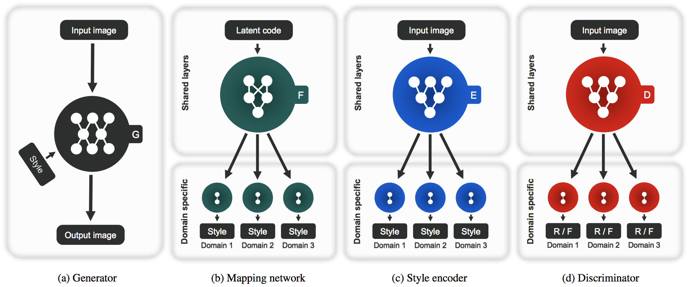
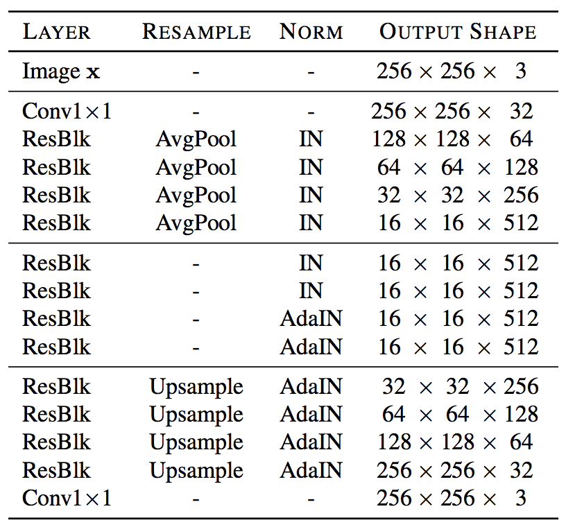
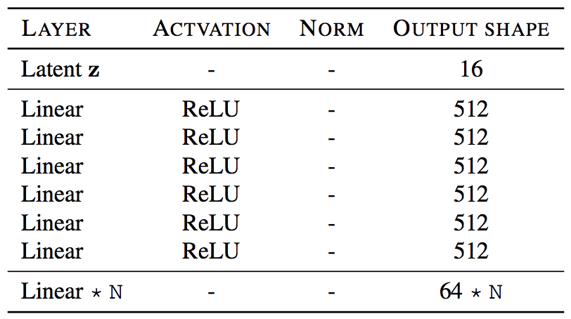
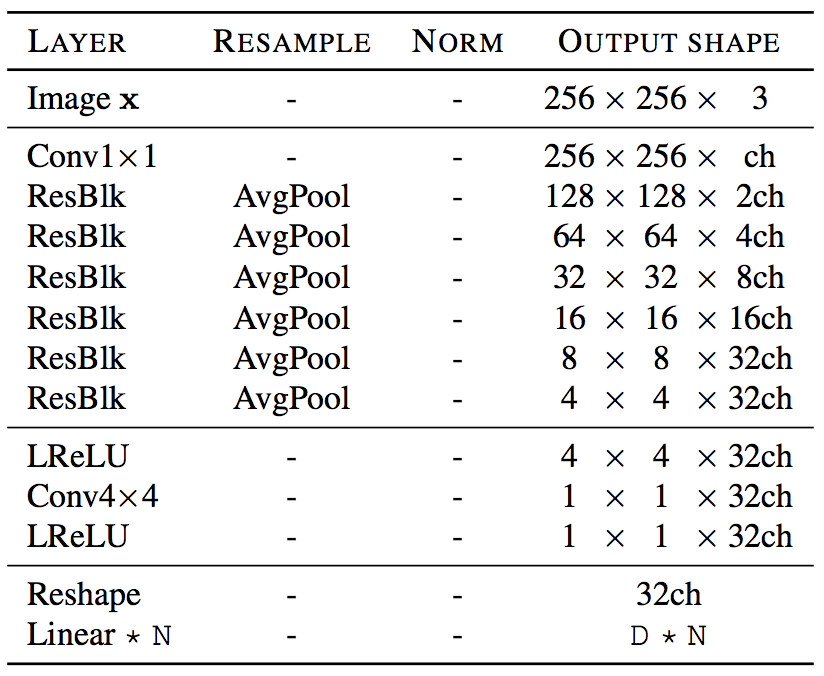
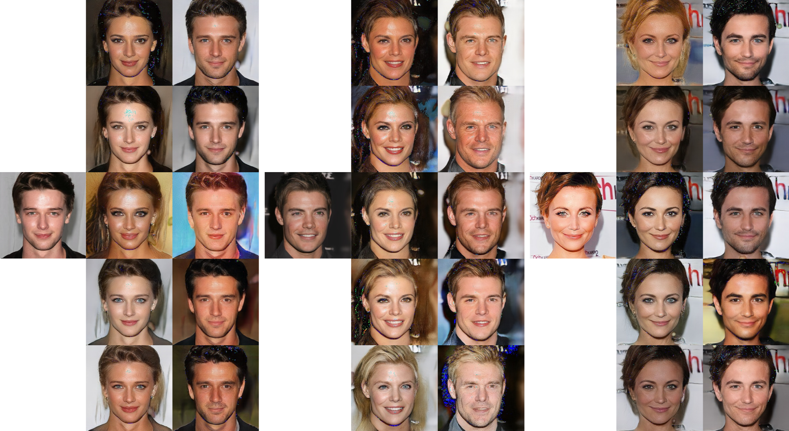
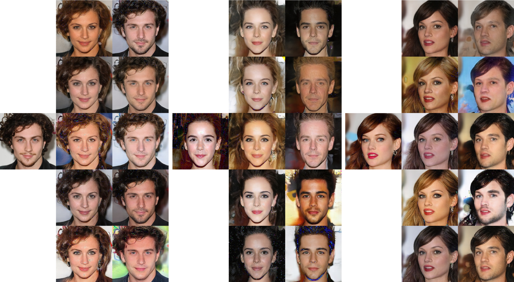

## StarGAN v2 &mdash; Un-official TensorFlow Implementation [[Paper]](https://arxiv.org/abs/1912.01865) [[Official code]](https://github.com/clovaai/stargan-v2)
### : Diverse Image Synthesis for Multiple Domains

<div align="center">
  
</div>

## Overview
<div align="center">
  
</div>

## Architecture
*Generator* | *Mapping Network* | *Style Encoder & Discriminator* |
:---: | :---: | :---: |
 |  |  |


## Usage
```
├── dataset
   └── YOUR_DATASET_NAME
       ├── train
           ├── domain1 (domain folder)
               ├── xxx.jpg (domain1 image)
               ├── yyy.png
               ├── ...
           ├── domain2
               ├── aaa.jpg (domain2 image)
               ├── bbb.png
               ├── ...
           ├── domain3
           ├── ...
       ├── test
           ├── zzz.jpg (any content image)
           ├── www.png
           ├── ...
```

### Train
```
python main.py --dataset celebA-HQ_gender --phase train --batch_size 2 --gpu_num 4
```

### Test
```
python main.py --dataset celebA-HQ_gender --phase test
```

### Refer test
```
python main.py --dataset celebA-HQ_gender --phase refer_test --refer_img_path refer_img.jpg
```

## Our results
<div align="center">
  
</div>

<div align="center">
  
</div>

<div align="center">
  
</div>

## Author
[Junho Kim](http://bit.ly/jhkim_ai)
